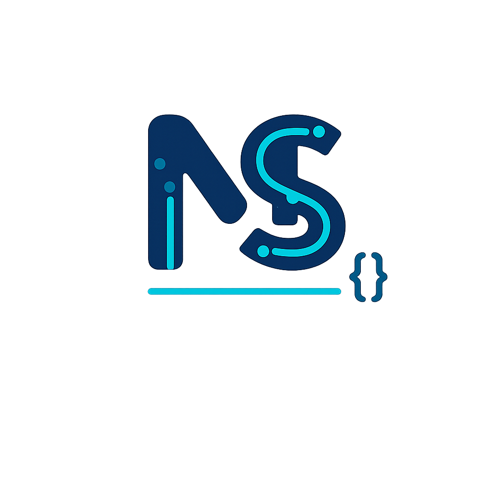

<h2 align="center">Hey...</h2>

###

  

###

 

I’m a passionate Android and Flutter Developer with a strong focus on creating clean, efficient, and user-friendly mobile applications. With nearly 4 years of hands-on experience, I’ve built and delivered multiple real-world projects — from native Android apps written in Java to cross-platform mobile solutions in Flutter.  I enjoy building apps that not only work well but also feel great to use. My goal is to craft meaningful digital experiences — combining modern UI/UX, scalable architecture, and optimized performance.

###

 

<h3 align="left">💻 What I Do !</h3>

###

 

- ** Android Development (Java, XML) - **  Building fast, stable, and secure Android apps with Firebase & REST APIs.  - **  Flutter Development (Dart) – Creating cross-platform apps for Android & iOS with responsive UIs.  - **  UI/UX Design Consulting – Turning concepts into polished, intuitive interfaces.  - **  Custom Android Libraries – Writing reusable tools like Editify, Adaptify, and Statusify to speed up development.

###

  
  
  

###

 

  
  
  
  
  
  
  
  
  
  
  
  
  
  
  
  
  

###

 

  
  

###

